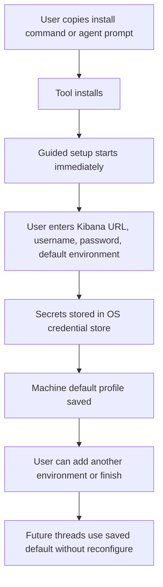

# Ergonomic Install and Durable Setup

## Problem Frame

The current setup story is workable for technical operators, but it is still too friction-heavy for non-technical users and for lightweight agent handoff. There is already a good long-form prompt in `INSTALL.md`, but there is not yet a true “copy this and go” machine-install surface for humans, and the normal setup story still leans too much on manual `KIBANA_*` configuration and explicit `configure` behavior.

That friction shows up in two visible ways:

- a user wants a simple install section with something they can copy directly into a shell or paste into an agent
- a newly opened thread may still require configuration work before the MCP is useful, which undermines the idea of “install once, use everywhere on this machine”

The goal is to make the product feel like a normal tool for non-technical users: install it with one command or one agent prompt, answer a short guided setup once, store the right machine-level defaults securely, and have future threads work without repeating setup.

## Approach Comparison

| Approach | Description | Pros | Cons | Recommendation |
| --- | --- | --- | --- | --- |
| Docs-only polish | Add clearer commands and prompts, but keep env vars and repeated configure steps as the main contract | Fastest to ship | Does not solve the new-thread or machine-level durability problem | No |
| Guided install plus durable machine profile | Offer copyable install surfaces for humans and agents, then launch a first-run setup that stores secrets securely and remembers a default profile for later threads | Solves both install friction and reconfiguration friction | Requires new profile/persistence behavior | Yes |
| Session-only setup | Launch a guided setup, but do not persist enough state to reuse it later | Lower security/storage complexity | Still forces repeated setup in new threads and new sessions | No |

## User Flow

## Requirements

**Install Surfaces**
- R1. The product must expose a copyable human install command that a non-technical user can run directly on their machine.
- R2. The product must expose a copyable agent prompt that a user can paste into Codex or another agent to complete installation and setup.
- R3. The public install story must support both a clone-free install path and a repo-based fallback path.
- R4. When clone-free install is not yet available in a given release posture, user-facing docs must say so clearly and present the repo-based fallback immediately below it rather than implying the simpler path already works.
- R5. The recommended install surface must be the simplest available path, but the fallback path must remain easy to find and copy.

**Guided Setup**
- R6. A normal supported install must launch guided setup immediately after installation instead of requiring users to manually define `KIBANA_*` variables before first use.
- R7. Guided setup must ask only for the minimum information needed for a first working connection:
  - Kibana base URL
  - username
  - password
  - a default environment/profile name
- R8. Guided setup must validate common input mistakes before saving, including the current known pitfall where a user pastes a full Kibana API endpoint instead of the base URL prefix.
- R9. Guided setup must offer an “add another environment” continuation after the first successful profile so users can save additional environments without rerunning the full install flow from scratch.

**Durable Machine-Level Use**
- R10. After first-run setup succeeds, the tool must persist a machine-level default profile so future threads on that machine can use the MCP without rerunning `configure`.
- R11. A newly opened thread should be able to use the saved default profile automatically unless the user explicitly chooses a different saved environment or the saved configuration is invalid.
- R12. The default user experience must be “install once, configure once, use across later threads” rather than “configure per thread.”
- R13. The setup model must support one default environment first, with optional additional named environments such as `prod` or `staging`.

**Secrets and Local State**
- R14. Secrets must be stored in the platform credential store rather than in normal documentation steps or hand-edited environment variables.
- R15. The supported secure storage story must cover macOS, Windows, and Linux from the start.
- R16. Non-secret local state such as saved environment names, source-catalog paths, or profile metadata must be stored separately from secrets.
- R17. If the platform credential store is unavailable, locked, or unsupported in a specific runtime context, the product must explain that clearly and guide the user to a supported fallback path without telling a non-technical user to export raw env vars manually as the primary flow.

**Cross-Surface Consistency**
- R18. The guided setup and durable-profile behavior must work for both human-driven installs and agent-driven installs.
- R19. The product’s public surfaces must consistently explain the install and setup story across `README.md`, `INSTALL.md`, the future Pages site, and plugin/package metadata.
- R20. The advanced env-var/bootstrap path may remain available for power users and compatibility, but it must no longer be the default onboarding story.

## Success Criteria

- A non-technical user can install the tool by copying either one shell command or one agent prompt.
- The normal install path reaches a guided setup flow without asking the user to define `KIBANA_*` variables by hand.
- A user enters connection details once and can open a new thread later without rerunning `configure`.
- A user can keep one default environment and optionally save additional named environments after the first successful setup.
- Public install docs clearly distinguish the preferred clone-free path from the repo-based fallback when package distribution status changes.

## Scope Boundaries

- No browser-based Kibana OAuth or SSO flow in this tranche.
- No requirement to sync saved environments across multiple machines.
- No replacement of the advanced env-var bootstrap path for power users or automation.
- No attempt to solve organization-wide fleet management or shared team credential provisioning.
- No requirement for a full graphical desktop UI; a guided CLI or agent-driven flow is sufficient if it is ergonomic for non-technical users.

## Key Decisions

- **Two first-class install surfaces:** The product should support both a human copy-paste install command and a copy-paste agent prompt.
- **Guided setup starts immediately after install:** The first-run flow should ask for only the minimum connection details and should not expect manual env-var editing.
- **Machine-level persistence is the default behavior:** New threads should inherit a saved default profile instead of requiring `configure` again.
- **One default profile first, more environments optionally:** The primary path stays simple for non-technical users, with multi-environment support exposed as a follow-up choice rather than as an upfront burden.
- **OS credential storage is the default secrets posture:** Secrets should live in the operating system credential store rather than in the normal install instructions or plain local config.
- **Env vars become an advanced compatibility path, not the main onboarding contract:** Keep them for power users, but do not force them into the normal first-run experience.

## Dependencies / Assumptions

- The tool will need a stable machine-local place to store non-secret profile metadata.
- The installation/runtime surfaces will need a way to resolve a saved default profile before requiring manual runtime `configure`.
- Public package distribution may still arrive later than the repo-based fallback, so install surfaces must handle staged availability cleanly.

## Outstanding Questions

### Resolve Before Planning
- None.

### Deferred to Planning
- [Affects R3-R5][Technical] What staged rollout shape best supports both clone-free install and repo-based fallback while the public package path is still gated?
- [Affects R10-R17][Technical] What machine-local profile format and lookup order should the runtime use so saved defaults work across new threads without breaking existing repo-local flows?
- [Affects R14-R17][Needs research] What is the most reliable cross-platform credential-store integration strategy for macOS, Windows, and Linux, and what fallback behavior is acceptable when Linux secret-store support is absent or locked?
- [Affects R6-R13][Technical] Should guided setup live in the CLI/runtime surface, in the plugin install flow, or in a shared setup command used by both?
- [Affects R18-R20][Technical] How should existing env-var-based users migrate to durable machine profiles without breaking current workflows?

## Next Steps

→ /prompts:ce-plan for structured implementation planning
