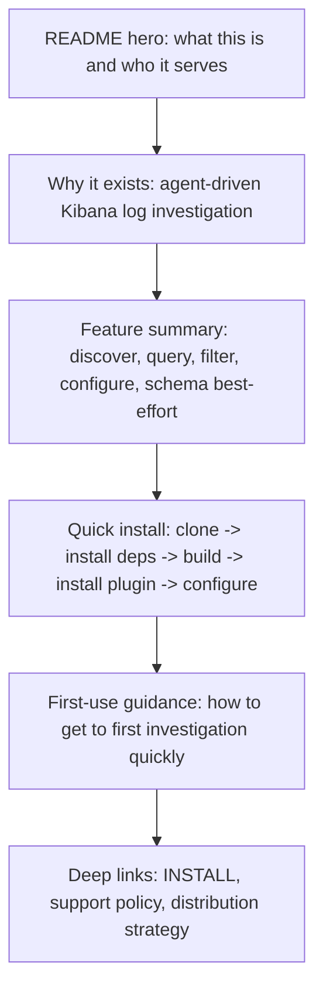

# feat: Create a GitHub landing page for Kibana MCP adoption

> [!NOTE]
> Historical plan. It was superseded by `docs/plans/2026-04-08-002-feat-github-pages-site-plan.md`, which was subsequently superseded by the implemented `docs/plans/2026-04-11-001-feat-github-pages-homepage-plan.md`.

## Overview

Rework the repository's public-facing GitHub presentation so a first-time visitor can understand why this MCP exists, what it can do, and how to install it quickly without reading the full technical reference first. The primary delivery surface is `README.md`, with supporting copy alignment in install and plugin-facing documentation where needed.

## Problem Frame

The repo already contains a credible MCP implementation, installation handoff, and support-policy documentation, but the current top-level README reads like technical product reference material rather than an acquisition and activation surface. A visitor landing on the repository can eventually find the install path and feature set, but the page does not currently lead with the user problem, the product value, or the fastest supported route to getting the MCP running.

This plan keeps the product framing grounded in the original Kibana MCP requirements: a small, reliable, read-only investigation surface for agents working against Kibana-backed logs (see origin: `docs/brainstorms/2026-04-02-kibana-log-investigation-requirements.md`). It also keeps the install story grounded in the currently supported repo-local Codex plugin path, as documented in `INSTALL.md`, `docs/project/distribution-strategy.md`, and `docs/project/support-policy.md`.

## Requirements Trace

- R1. The GitHub landing surface must explain why the repository exists in outcome-first language before diving into detailed technical reference material.
- R2. The landing surface must present the current feature set accurately, grounded in the supported MCP capabilities and known environment constraints.
- R3. The landing surface must provide a fast, credible install path that emphasizes the guaranteed repo-local Codex plugin workflow and does not overstate the planned public package path.
- R4. The quick-start flow must get a visitor from clone to first useful use without forcing them to read the full configuration reference up front.
- R5. Public-facing copy across README, install handoff, and plugin metadata must stay aligned so users are not told conflicting stories about distribution, support, or first-run setup.

## Scope Boundaries

- No separate GitHub Pages or external marketing site.
- No new MCP tools, backend behavior, or packaging work beyond documentation and metadata alignment.
- No change to the current support contract that repo-local Codex plugin install is the guaranteed path and public package install is planned rather than default.
- No attempt to hide environmental limitations such as schema endpoint variability or manual plugin-install fallback on some Codex model variants.
- No GitHub repository settings automation; any repo "About" blurb or social-preview image updates remain manual follow-up outside this plan.

## Context & Research

### Relevant Code and Patterns

- `README.md` is already the repository's public entry point, but its opening structure is reference-heavy and tool-oriented.
- `INSTALL.md` is the canonical operator handoff and already defines the supported fast path: clone, ensure Node.js 22+, `npm install`, `npm run build`, install the repo-local plugin, then configure the MCP.
- `docs/project/distribution-strategy.md` establishes that repo-local Codex plugin install is guaranteed and public package distribution is planned but gated.
- `docs/project/support-policy.md` captures important install and environment constraints that should be summarized, not hidden, in public-facing copy.
- `plugins/kibana-log-investigation/.codex-plugin/plugin.json` is a user-facing metadata surface inside Codex and should not drift from the README's positioning.

### Institutional Learnings

- `docs/solutions/documentation-gaps/self-contained-codex-install-handoff-2026-04-08.md` shows that install handoff quality improves when the repo-local plugin path, environment naming, manual fallback flow, and `KIBANA_BASE_URL` rule are all explicit and self-contained.
- `docs/solutions/integration-issues/kibana-mcp-config-reset-after-restart-2026-04-03.md` reinforces that runtime configuration persistence is part of the operator story and should be explained accurately when describing setup.
- `docs/solutions/integration-issues/kibana-mcp-schema-endpoints-may-be-unavailable-2026-04-03.md` reinforces that schema-aware features are environment-dependent and should be presented as best-effort rather than universal.

### External References

- None. The repository already has strong local guidance for install posture, support boundaries, and product framing, so external research would add little value for this plan.

## Key Technical Decisions

- **Treat `README.md` as the GitHub landing page:** The user request is best satisfied by restructuring the repository README rather than introducing a separate site or docs app.
- **Lead with operator problem and activation path, not tool inventory:** The opening sections should explain who this is for, why it exists, and what outcome it enables before listing detailed tool shapes.
- **Keep the quick install path anchored to the guaranteed repo-local workflow:** The README should present the current supported path clearly and mention the future `npx` path only as planned status, not as the primary call to action.
- **Use layered documentation instead of stuffing every caveat into the hero section:** README should offer concise positioning, features, and quick-start steps, then link to `INSTALL.md` and project policy docs for deeper detail.
- **Align all public-facing descriptions with the actual product contract:** README, install handoff, and Codex plugin metadata should all tell the same story about capabilities, limitations, and setup.

## Open Questions

### Resolved During Planning

- Does "GitHub landing page" mean a separate hosted page? No. For this repo, the right implementation target is the top-level `README.md`.
- Should the landing page promote public package installation as the default path? No. The guaranteed path remains repo-local Codex plugin install; public package install stays clearly marked as planned.
- Should the README keep every setup caveat inline? No. The README should summarize the critical path and link to deeper install/support docs for full operator detail.

### Deferred to Implementation

- Whether the first README revision needs a visual asset such as a screenshot, diagram, or social-preview image, or whether a strong text-first structure is sufficient.
- Whether maintainers also want to manually update the GitHub repository "About" blurb, topic tags, or social preview to mirror the new README positioning.
- Whether a lightweight documentation contract test is worth adding later if copy drift becomes recurrent across README and plugin metadata.

## High-Level Technical Design

> *This illustrates the intended approach and is directional guidance for review, not implementation specification. The implementing agent should treat it as context, not code to reproduce.*

The intended shape is a funnel: orient the visitor, prove value quickly, give them a supported install path, then move deeper details lower on the page or into linked operator docs.

## Implementation Units

- [ ] **Unit 1: Reframe the README above the fold**

**Goal:** Make the first screen of the repository immediately explain the product, audience, and reason it exists.

**Requirements:** R1, R2

**Dependencies:** None

**Files:**
- Modify: `README.md`

**Approach:**
- Replace the current reference-style opening with outcome-first positioning for operators and agents investigating incidents through Kibana-backed logs.
- Add a concise "why it exists" section derived from the origin requirements so visitors understand the user problem before the tool list.
- Summarize the core supported capabilities in landing-page language while preserving accuracy: read-only posture, configured logical sources, discovery, querying, filtering, and environment-dependent schema support.
- Push exhaustive configuration and backend detail lower in the file so the top of the README behaves like a landing page rather than an API manual.

**Patterns to follow:**
- Reuse the product framing from `docs/brainstorms/2026-04-02-kibana-log-investigation-requirements.md`.
- Keep support caveats consistent with `docs/project/support-policy.md`.

**Test scenarios:**
- Test expectation: none -- this unit changes documentation structure and messaging, not executable behavior.

**Verification:**
- A first-time GitHub visitor can answer "What is this?", "Who is it for?", and "Why does it exist?" from the README opening without scrolling into the full reference content.

- [ ] **Unit 2: Add a credible quick-install and first-use funnel**

**Goal:** Make the path from repo landing to first working Kibana MCP session short, obvious, and accurate.

**Requirements:** R3, R4

**Dependencies:** Unit 1

**Files:**
- Modify: `README.md`
- Modify: `INSTALL.md`

**Approach:**
- Add a short quick-start sequence near the top of `README.md` that uses the guaranteed repo-local flow: clone, ensure Node.js 22+, `npm install`, `npm run build`, install `Kibana Log Investigation`, then configure the server.
- Include one concise "what to do next" handoff after install so the visitor knows how to get from installation into discovery/query usage.
- Keep the future `npx` path visible only as planned status so the README stays honest about current distribution.
- Use `INSTALL.md` as the deep-link target for full setup detail, multi-environment notes, manual plugin-install fallback, and `KIBANA_BASE_URL` rules instead of duplicating all edge-case guidance inline.

**Patterns to follow:**
- Reuse the fast-path language already present in `INSTALL.md`.
- Keep distribution claims aligned with `docs/project/distribution-strategy.md`.

**Test scenarios:**
- Test expectation: none -- this unit refines installation guidance and user flow copy rather than runtime logic.

**Verification:**
- A visitor can follow the README quick-start path without ambiguity about the supported install method or the next step after installation.

- [ ] **Unit 3: Align supporting public metadata and deep links**

**Goal:** Prevent public-facing copy drift between the README and other user-visible repository surfaces.

**Requirements:** R2, R3, R5

**Dependencies:** Units 1-2

**Files:**
- Modify: `README.md`
- Modify: `plugins/kibana-log-investigation/.codex-plugin/plugin.json`
- Modify: `docs/project/support-policy.md`
- Modify: `docs/project/distribution-strategy.md`

**Approach:**
- Review the Codex plugin's short and long descriptions so they reinforce the same positioning as the README instead of introducing a second story about installation or capabilities.
- Tighten README deep links into support and distribution docs so users who need detail can find it from the landing page without hunting.
- Adjust wording in support/distribution docs only if the new README framing exposes mismatches or outdated phrasing; avoid gratuitous rewrites.
- Record any out-of-repo follow-up, such as a manual GitHub "About" update, as an operational note rather than stretching this implementation into repository-settings work.

**Patterns to follow:**
- Keep plugin-facing messaging consistent with `plugins/kibana-log-investigation/.codex-plugin/plugin.json`.
- Preserve the guaranteed-vs-planned install split already defined in `docs/project/distribution-strategy.md`.

**Test scenarios:**
- Test expectation: none -- this unit aligns public-facing copy and documentation links, not behavior under test.

**Verification:**
- Users see one consistent product and install story across the GitHub README, Codex plugin metadata, and linked policy docs.

## System-Wide Impact

- **Interaction graph:** `README.md` becomes the front door, `INSTALL.md` remains the full operator handoff, and `docs/project/support-policy.md` plus `docs/project/distribution-strategy.md` stay the authoritative sources for caveats and install posture.
- **Error propagation:** If README claims drift from support/distribution reality, users will fail during setup and support churn will increase even though the runtime code is unchanged.
- **State lifecycle risks:** Duplicated quick-start and caveat text can drift over time; the plan mitigates this by keeping README concise and linking to deeper single-purpose docs for detail.
- **API surface parity:** Feature summaries must remain consistent with the actual MCP surface (`configure`, `describe_fields`, `discover`, `filter`, `query`) and with the repo's current "planned vs guaranteed" distribution contract.
- **Integration coverage:** Manual README rendering review on GitHub is the meaningful cross-surface verification here, because the change spans repo docs and Codex plugin presentation rather than executable runtime behavior.
- **Unchanged invariants:** The MCP remains read-only, log-investigation-focused, and primarily distributed through the repo-local Codex plugin workflow.

## Risks & Dependencies

| Risk | Mitigation |
|------|------------|
| The README becomes too long or collapses back into reference-style prose | Keep the top section tightly focused on positioning, features, and quick start, then link to deeper docs for configuration detail |
| The landing page overpromises package availability or schema support | Review all new copy against `docs/project/distribution-strategy.md` and `docs/project/support-policy.md` before landing |
| Quick-start instructions drift from the canonical install handoff over time | Keep `INSTALL.md` as the full procedure and make the README a concise funnel into it rather than a duplicate operator manual |

## Documentation / Operational Notes

- After the README rewrite lands, review the rendered GitHub page in the browser to confirm section order, scannability, and code-block density feel like a landing page rather than a reference dump.
- If maintainers want the GitHub repository "About" description or social preview image to match the new README framing, that is a separate manual GitHub settings task outside this repo.

## Sources & References

- **Origin document:** `docs/brainstorms/2026-04-02-kibana-log-investigation-requirements.md`
- Related docs: `README.md`, `INSTALL.md`, `docs/project/distribution-strategy.md`, `docs/project/support-policy.md`
- Related learnings: `docs/solutions/documentation-gaps/self-contained-codex-install-handoff-2026-04-08.md`, `docs/solutions/integration-issues/kibana-mcp-config-reset-after-restart-2026-04-03.md`, `docs/solutions/integration-issues/kibana-mcp-schema-endpoints-may-be-unavailable-2026-04-03.md`
- Related metadata: `plugins/kibana-log-investigation/.codex-plugin/plugin.json`
