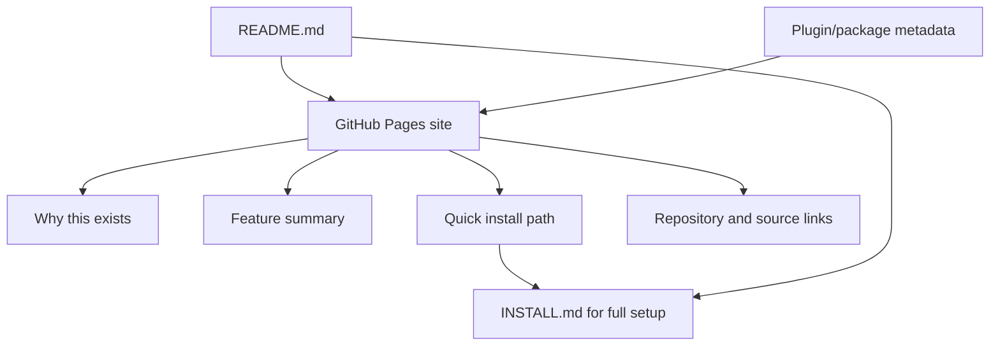
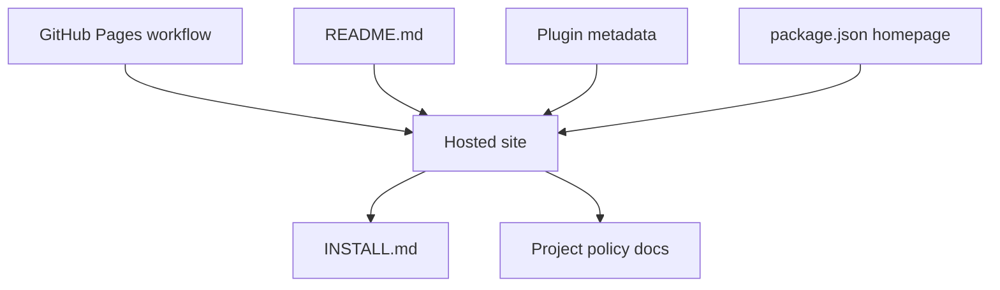

# feat: Create a GitHub Pages site for Kibana MCP adoption

> [!NOTE]
> Historical plan. It was superseded by the implemented `docs/plans/2026-04-11-001-feat-github-pages-homepage-plan.md`.

## Overview

Create a real GitHub Pages site for this repository that explains why the Kibana MCP exists, what it can do, and how to install it quickly, then reposition `README.md` to act as the repo-native funnel into that hosted site and the deeper operator docs.

This plan supersedes the narrower README-only direction in `docs/plans/2026-04-08-001-feat-github-landing-page-plan.md`. The user explicitly wants the hosted GitHub Pages surface first and the GitHub repository landing page second.

## Problem Frame

The repository already has credible operator docs, installation handoff, and support-policy material, but they are optimized for someone who has already committed to the repo rather than someone evaluating whether this MCP is worth adopting. The current top-level README can be improved, but it is still constrained by the repository context and by the need to carry technical reference material.

The user now wants a dedicated GitHub Pages site that can behave like a lightweight product site: explain the problem, present the features, and offer a fast install path without forcing first-time visitors into the full reference surface immediately. That public site must stay grounded in the actual product contract: a small, read-only MCP for investigation work against Kibana-backed logs, installed today through the repo-local Codex plugin workflow (see origin: `docs/brainstorms/2026-04-02-kibana-log-investigation-requirements.md`, `INSTALL.md`, and `docs/project/distribution-strategy.md`).

## Requirements Trace

- R1. Provide a real GitHub Pages site for this repository, not just a rewritten `README.md`.
- R2. The Pages site must explain why the MCP exists in outcome-first language before diving into technical reference detail.
- R3. The Pages site must present the current feature set accurately, including read-only posture and environment-dependent schema behavior.
- R4. The site must offer a fast, credible installation path centered on the guaranteed repo-local Codex plugin workflow and must not overstate the future public package path.
- R5. `README.md` must be repositioned to support the hosted site rather than competing with it, while still serving repo-native readers.
- R6. The deployment approach must stay low-maintenance, repo-native, and compatible with the repo’s current Node/GitHub Actions posture.
- R7. Public-facing copy across the Pages site, `README.md`, plugin metadata, and linked project docs must remain aligned.

## Scope Boundaries

- No external hosting beyond GitHub Pages.
- No server-side runtime, analytics platform, CMS, or interactive backend for the site.
- No change to MCP runtime behavior, tool shapes, or install support posture beyond public-facing documentation and metadata alignment.
- No custom domain requirement in this tranche.
- No manual GitHub repository setting automation beyond documenting the required GitHub Pages configuration step.
- No attempt to replace `INSTALL.md`, `README.md`, or `docs/project/*` as the long-form operator references.

## Context & Research

### Relevant Code and Patterns

- `README.md` is currently the public entry point, but it is still primarily a reference document rather than a dedicated adoption surface.
- `INSTALL.md` is the canonical operator handoff and already contains the supported fast path: clone, ensure Node.js 22+, `npm install`, `npm run build`, install the repo-local plugin, then configure the MCP.
- `docs/project/distribution-strategy.md` establishes that the guaranteed install path is the repo-local Codex plugin workflow, while public package execution is planned but gated.
- `docs/project/support-policy.md` captures important limitations that the public site must summarize honestly, especially the manual plugin-install fallback on some Codex variants and best-effort schema support.
- `.github/workflows/ci.yml` and `.github/workflows/release.yml` show that the repo already uses GitHub Actions and Node-based automation; there is no existing docs-site or Pages deployment workflow to inherit.
- `package.json` and `plugins/kibana-log-investigation/.codex-plugin/plugin.json` currently point public-facing homepage and website metadata back to the GitHub repository, which becomes a drift risk once a dedicated public site exists.

### Institutional Learnings

- `docs/solutions/documentation-gaps/self-contained-codex-install-handoff-2026-04-08.md` shows that adoption quality improves when the install path, environment naming rules, manual fallback, and `KIBANA_BASE_URL` constraints are explicit and self-contained.
- `docs/solutions/integration-issues/kibana-mcp-config-reset-after-restart-2026-04-03.md` reinforces that configuration persistence is part of the operator story and should be described accurately in any public onboarding path.
- `docs/solutions/integration-issues/kibana-mcp-schema-endpoints-may-be-unavailable-2026-04-03.md` reinforces that schema-aware behavior is environment-dependent and should be positioned as best-effort, not universal.

### External References

- GitHub Pages docs say an existing repository can publish a site either from a branch/folder or from a custom GitHub Actions workflow, and recommend a custom workflow when you want a build process other than Jekyll or do not want a dedicated branch for compiled static files. This is directly relevant because this repo already uses `docs/` for internal documentation and has no existing Pages branch or site build stack. Source: [GitHub Docs: Configuring a publishing source for your GitHub Pages site](https://docs.github.com/en/pages/getting-started-with-github-pages/configuring-a-publishing-source-for-your-github-pages-site).
- GitHub Pages docs say a custom workflow should use `actions/configure-pages`, `actions/upload-pages-artifact`, and `actions/deploy-pages`, with `pages: write` and `id-token: write` permissions on the deploy job. Source: [GitHub Docs: Using custom workflows with GitHub Pages](https://docs.github.com/en/pages/getting-started-with-github-pages/using-custom-workflows-with-github-pages).
- GitHub Pages docs say the deployed artifact must contain the entry file at the top level. Source: [GitHub Docs: Creating a GitHub Pages site](https://docs.github.com/en/pages/getting-started-with-github-pages/creating-a-github-pages-site).

## Key Technical Decisions

- **Create a dedicated `site/` source tree for the public Pages site:** This keeps the public site separate from the repo’s internal `docs/` tree, which already contains plans, brainstorms, solution notes, and project-policy documents that should not become the publishing root.
- **Use a custom GitHub Actions Pages workflow instead of branch- or `/docs`-based publishing:** This follows GitHub’s current recommendation for non-Jekyll publishing and avoids turning the existing `docs/` folder into a public deploy source or introducing a separate compiled branch.
- **Keep the site build-light and static-first:** Given the repo’s current shape, a small static site with checked-in HTML/CSS/assets is a better fit than adding a new site generator or frontend framework purely for marketing copy and onboarding. This is an inference from the repo structure plus GitHub’s guidance that custom workflows can deploy arbitrary static artifacts.
- **Use the site as the primary narrative surface and `README.md` as the repo-native conversion surface:** Visitors arriving through GitHub Pages should get the full public story there, while repository visitors should get a concise explanation plus a clear CTA into the site and installation docs.
- **Preserve one truthful install story across all surfaces:** The site, README, plugin metadata, and package metadata must all reinforce that repo-local Codex plugin install is the guaranteed path today and that public package usage is planned rather than current default behavior.

## Open Questions

### Resolved During Planning

- Should this be a hosted GitHub Pages site or just a README refresh? Hosted GitHub Pages site first, README second, per user instruction.
- Should the Pages source come from the existing `/docs` folder? No. This repo already uses `docs/` for internal documentation and planning artifacts, so making it the Pages publishing root would mix public marketing content with internal project docs.
- Should the repo introduce Jekyll or another new site stack by default? No. The repo has no existing docs-site stack, and a small static site deployed via a custom GitHub Actions workflow is the lower-maintenance fit.

### Deferred to Implementation

- Whether the public site should be single-page only or include one or two additional static pages such as `/install` or `/faq` after the first draft is visible.
- Whether maintainers want to move `package.json` `homepage` and plugin `websiteURL` immediately to the Pages URL or keep the repository URL until the first deployment is live.
- Whether a future custom domain or social-preview image should be added once the Pages site content stabilizes.

## High-Level Technical Design

> *This illustrates the intended approach and is directional guidance for review, not implementation specification. The implementing agent should treat it as context, not code to reproduce.*

The intended shape is a two-surface funnel: the hosted site carries the public narrative and quick activation path, while the repository README and metadata point users into that site and then into deeper operator docs.

## Implementation Units

- [ ] **Unit 1: Define and build the public Pages site surface**

**Goal:** Create the checked-in static site source that presents the product story, feature set, and supported quick-start path.

**Requirements:** R1, R2, R3, R4

**Dependencies:** None

**Files:**
- Create: `site/index.html`
- Create: `site/styles.css`
- Create: `site/404.html`
- Optionally create: `site/assets/`
- Create: `test/site_contract.test.ts`

**Approach:**
- Build a dedicated public site entry point in `site/` rather than repurposing `README.md` or the internal `docs/` tree.
- Structure the first version around four content jobs: why it exists, what it does, quick install, and where to go next for setup/reference.
- Keep install guidance concise and outcome-oriented on the site itself, then deep-link to `INSTALL.md`, `README.md`, and the relevant project-policy docs for detailed operator guidance.
- Present schema-aware capabilities and install automation honestly, using the best-effort language already established in project docs rather than polishing away those constraints.

**Execution note:** Add the site contract test alongside the first page so future copy or structure edits cannot silently remove the required product sections.

**Patterns to follow:**
- Reuse the product framing from `docs/brainstorms/2026-04-02-kibana-log-investigation-requirements.md`.
- Reuse install constraints and fast-path language from `INSTALL.md`.
- Keep support caveats aligned with `docs/project/support-policy.md`.

**Test scenarios:**
- Happy path: the site entry file exposes distinct sections or landmarks for product purpose, feature summary, and quick install.
- Happy path: the site includes outbound links to the repository, `INSTALL.md`, and deeper documentation targets.
- Edge case: the custom `404.html` preserves a path back to the install/repo surfaces instead of dead-ending the visitor.
- Error path: if future edits remove the supported-install language or Pages entry file, `test/site_contract.test.ts` fails.
- Integration: the checked-in site content references the same guaranteed install path and support posture as the repo docs, not a divergent story.

**Verification:**
- Opening the built Pages artifact locally or from the deployed site makes the product, feature set, and install CTA understandable without reading the full README first.

- [ ] **Unit 2: Add GitHub Pages deployment workflow and repository contract**

**Goal:** Deploy the `site/` artifact through GitHub Pages in a repo-native, low-maintenance way.

**Requirements:** R1, R6

**Dependencies:** Unit 1, repository admin or maintainer access to configure GitHub Pages for this repository

**Files:**
- Create: `.github/workflows/pages.yml`
- Modify: `test/project_contract.test.ts`

**Approach:**
- Add a dedicated Pages workflow that follows GitHub’s current custom-workflow model using `actions/configure-pages`, `actions/upload-pages-artifact`, and `actions/deploy-pages`.
- Configure the workflow around the repo’s current default branch and manual dispatch, with a separate deploy job that has the required `pages: write` and `id-token: write` permissions.
- Upload only the `site/` artifact so the published surface stays intentionally curated and does not accidentally expose internal documentation trees.
- Document the required GitHub repository setting change in the plan’s operational notes: Pages source must be set to GitHub Actions.

**Patterns to follow:**
- Mirror the repository’s existing GitHub Actions conventions in `.github/workflows/ci.yml` and `.github/workflows/release.yml`.
- Follow GitHub’s official Pages workflow contract from the external references above.

**Test scenarios:**
- Happy path: workflow configuration targets the Pages artifact path and includes the official configure/upload/deploy actions.
- Happy path: the deploy job declares the `github-pages` environment and required permissions.
- Error path: if the workflow is removed or the artifact path no longer points at `site/`, the project-contract test fails.
- Integration: the deployed artifact contains a top-level entry file as required by GitHub Pages and is independent of the repo’s internal `docs/` tree.

**Verification:**
- A push to the default branch can deploy the `site/` artifact through GitHub Pages without requiring a dedicated `gh-pages` branch or a Jekyll build path.

- [ ] **Unit 3: Reposition the repository landing surfaces around the hosted site**

**Goal:** Make `README.md` and repo-facing metadata reinforce the hosted site instead of competing with it.

**Requirements:** R4, R5, R7

**Dependencies:** Units 1-2

**Files:**
- Modify: `README.md`
- Modify: `plugins/kibana-log-investigation/.codex-plugin/plugin.json`
- Modify: `package.json`
- Test: `test/site_contract.test.ts`
- Test: `test/package_contract.test.ts`

**Approach:**
- Rewrite the top of `README.md` so repository visitors immediately understand the product and are directed to the hosted Pages site for the polished overview, while still preserving a fast path into install and technical reference material.
- Update plugin and package metadata so public-facing URLs and descriptions do not keep pointing users only at the repository once the hosted site exists.
- Keep the README shorter and more conversion-oriented than the full reference; it should summarize the value and install path, then link outward instead of trying to duplicate the entire public site.
- If changing `package.json` `homepage` immediately feels too coupled to first deployment timing, preserve that as a consciously deferred implementation decision rather than leaving it inconsistent by accident.

**Patterns to follow:**
- Preserve the guaranteed-vs-planned install split already documented in `docs/project/distribution-strategy.md`.
- Keep plugin messaging aligned with the current interface fields in `plugins/kibana-log-investigation/.codex-plugin/plugin.json`.

**Test scenarios:**
- Happy path: `README.md` points repo visitors to the hosted site while still exposing the supported install flow.
- Happy path: plugin/package metadata use URLs and descriptions that align with the hosted site and repo story.
- Error path: if metadata drifts back to an outdated install or capability description, the relevant contract test fails.
- Integration: repository visitors can move coherently from README -> hosted site -> install docs without contradictory claims about packaging, support, or environment limits.

**Verification:**
- Users landing through GitHub repository surfaces receive one coherent story and one clear path into the hosted site and install docs.

- [ ] **Unit 4: Fold the Pages site into release and documentation governance**

**Goal:** Keep the new public site from becoming an unmanaged side surface that drifts away from the real product contract.

**Requirements:** R6, R7

**Dependencies:** Units 2-3

**Files:**
- Modify: `docs/project/release-checklist.md`
- Optionally modify: `docs/project/distribution-strategy.md`
- Optionally modify: `docs/project/support-policy.md`
- Test: `test/project_contract.test.ts`

**Approach:**
- Add release/verification guidance so maintainers explicitly review the Pages site, its deployment, and its public claims as part of ongoing repo hygiene.
- Update distribution/support docs only where the new hosted site changes the public entrypoint or exposes wording drift; do not rewrite those docs gratuitously.
- Treat the Pages site as part of the repository’s public contract, not as disposable marketing copy. The site must stay aligned with the same install, compatibility, and support posture already documented elsewhere.

**Patterns to follow:**
- Reuse the repo’s existing contract-test mindset from `test/package_contract.test.ts` and `test/project_contract.test.ts`.
- Keep policy documents in `docs/project/` authoritative for support/distribution specifics.

**Test scenarios:**
- Happy path: release/governance docs explicitly mention Pages verification and public-surface review.
- Edge case: a future maintainer updates support/distribution posture and has an obvious place to keep the site aligned.
- Integration: the public site, README, and policy docs continue to describe the same guaranteed install path and known constraints.

**Verification:**
- The hosted site is part of normal repository maintenance instead of becoming a one-off launch artifact that drifts from reality.

## System-Wide Impact

- **Interaction graph:** GitHub Pages workflow, hosted static assets, `README.md`, plugin/package metadata, and the existing install/support docs all become one public adoption system rather than loosely related files.
- **Error propagation:** If the site overpromises install simplicity or schema behavior, users will fail during setup even though the MCP runtime itself is unchanged.
- **State lifecycle risks:** Public site copy can drift away from README and policy docs unless contract tests and release-checklist review make alignment explicit.
- **API surface parity:** The site’s feature descriptions must continue to match the real MCP tool surface (`configure`, `describe_fields`, `discover`, `filter`, `query`) and the project’s guaranteed-vs-planned install contract.
- **Integration coverage:** The meaningful cross-layer verification is not runtime logic; it is proving that Pages deployment, site content, repo metadata, and linked docs still describe the same product.
- **Unchanged invariants:** The MCP remains read-only, log-investigation-focused, and guaranteed today through the repo-local Codex plugin workflow.

## Risks & Dependencies

| Risk | Mitigation |
|------|------------|
| The hosted site becomes a second, drifting product story | Add contract tests and release-checklist review that treat the site as part of the repo’s public contract |
| The implementation over-engineers a simple static marketing surface with a new frontend stack | Keep the first tranche static-first and deploy only checked-in artifacts unless a later need clearly justifies more tooling |
| The Pages deployment path accidentally exposes internal `docs/` content or depends on Jekyll assumptions | Deploy only the curated `site/` artifact through a custom Pages workflow |
| The public site overstates future package availability or universal schema support | Review site copy against `docs/project/distribution-strategy.md` and `docs/project/support-policy.md` before landing |
| No one with the required repo permissions completes the Pages configuration step | Call out the maintainer/admin prerequisite explicitly and make Pages-source setup part of verification |
| Repo settings are forgotten and the workflow exists without a live site | Document the required Pages source setting (`GitHub Actions`) in the operational notes and verification criteria |

## Documentation / Operational Notes

- Repository settings must be updated so GitHub Pages uses `GitHub Actions` as the publishing source.
- Someone with admin or maintainer permissions must perform that Pages configuration step.
- After the first deployment, manually verify the rendered site, navigation, and links from the live Pages URL, not just the checked-in files.
- If maintainers later want a custom domain, social-preview image, or richer site IA, treat that as a follow-on plan rather than bloating this first Pages tranche.

## Sources & References

- **Origin document:** `docs/brainstorms/2026-04-02-kibana-log-investigation-requirements.md`
- Related plan superseded in scope: `docs/plans/2026-04-08-001-feat-github-landing-page-plan.md`
- Related docs: `README.md`
- Related docs: `INSTALL.md`
- Related docs: `docs/project/distribution-strategy.md`
- Related docs: `docs/project/support-policy.md`
- Related metadata: `plugins/kibana-log-investigation/.codex-plugin/plugin.json`
- Related metadata: `package.json`
- Related workflows: `.github/workflows/ci.yml`
- Related workflows: `.github/workflows/release.yml`
- Related learnings: `docs/solutions/documentation-gaps/self-contained-codex-install-handoff-2026-04-08.md`
- Related learnings: `docs/solutions/integration-issues/kibana-mcp-config-reset-after-restart-2026-04-03.md`
- Related learnings: `docs/solutions/integration-issues/kibana-mcp-schema-endpoints-may-be-unavailable-2026-04-03.md`
- External docs: https://docs.github.com/en/pages/getting-started-with-github-pages/creating-a-github-pages-site
- External docs: https://docs.github.com/en/pages/getting-started-with-github-pages/configuring-a-publishing-source-for-your-github-pages-site
- External docs: https://docs.github.com/en/pages/getting-started-with-github-pages/using-custom-workflows-with-github-pages
