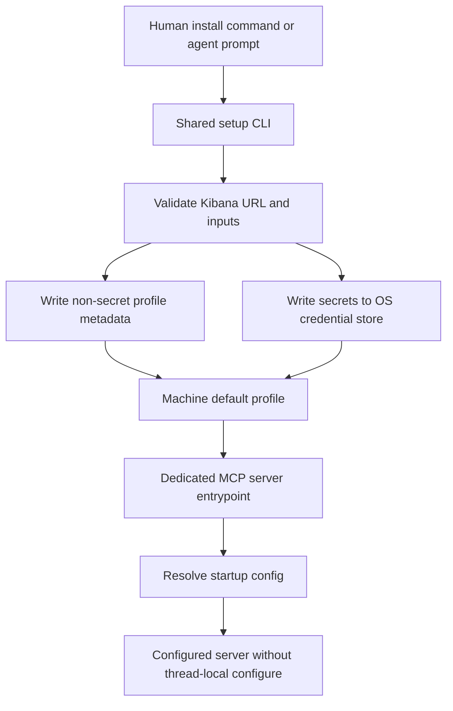
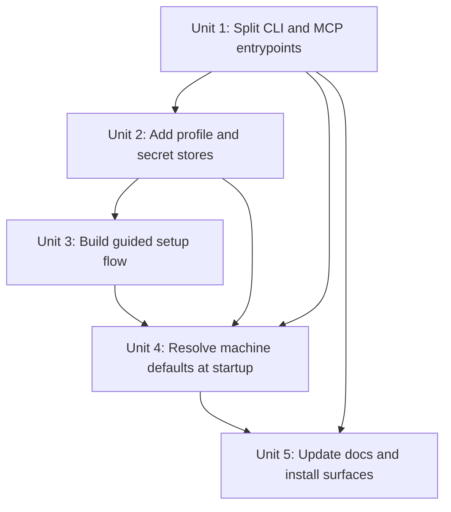
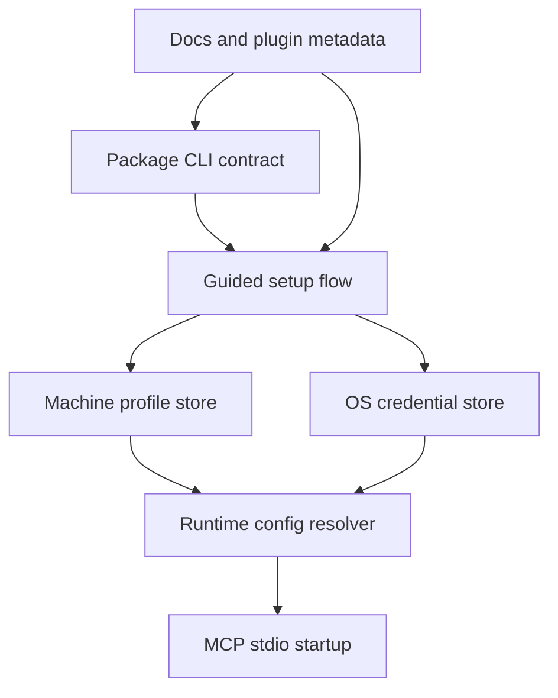

# feat: Add ergonomic install and durable machine setup

## Overview

Turn the current technical-operator onboarding flow into a durable end-user install experience with two first-class entry surfaces: a human copy-paste install command and an agent copy-paste prompt. The normal path should launch guided setup immediately, store secrets in the platform credential store, persist a machine-level default profile, and let future threads use the MCP without rerunning `configure`.

This plan also preserves the current truth that public package installation is not yet the guaranteed default path. The implementation should therefore support a staged rollout: land the shared setup architecture and repo-based fallback first, while making the clone-free package path a controlled activation once publish prerequisites are satisfied (see origin: `docs/brainstorms/2026-04-09-ergonomic-install-and-durable-setup-requirements.md`).

## Problem Frame

The repo currently serves technical operators reasonably well, but it still exposes too much setup machinery to normal users. The top-level docs already contain a useful long-form prompt, and the runtime already persists non-secret source catalogs, but the primary onboarding contract still assumes one or more of the following:

- a user or agent will define `KIBANA_*` variables manually
- a thread will call `configure` explicitly before the MCP is useful
- installation is primarily a repo-local developer workflow, not a normal machine install surface

That model breaks down for the user goal captured in the origin document: non-technical users should be able to install by copying one shell command or one agent prompt, answer a short guided setup once, and then reuse the tool across later threads on the same machine without repeating configuration (see origin: `docs/brainstorms/2026-04-09-ergonomic-install-and-durable-setup-requirements.md`).

## Requirements Trace

- R1-R5. Add first-class install surfaces for humans and agents, with a staged clone-free path and a credible repo-based fallback.
- R6-R9. Replace manual env-var onboarding with immediate guided setup that validates common mistakes and supports optional additional environments.
- R10-R13. Persist a machine-level default profile so new threads work without rerunning `configure`, while still supporting optional named environments.
- R14-R17. Store secrets in platform credential stores and keep non-secret machine state separate, with explicit fallback behavior when secret storage is unavailable.
- R18-R20. Keep the guided setup behavior consistent across install surfaces and demote env vars to an advanced compatibility path rather than the default onboarding story.

## Scope Boundaries

- No browser-based OAuth or SSO flow.
- No multi-machine profile sync or team-wide credential distribution.
- No removal of the advanced env-var bootstrap path for power users or automation.
- No requirement for a graphical desktop UI; an ergonomic CLI/agent setup flow is sufficient.
- No attempt to solve organization-wide package distribution policy beyond the repo’s existing trusted-publishing and package-ownership boundaries.

## Context & Research

### Relevant Code and Patterns

- `src/index.ts` currently serves as both the npm `bin` entrypoint and the MCP stdio server entrypoint. It only loads startup config from environment variables and otherwise starts unconfigured.
- `src/server.ts` already supports runtime `configure`, but when no startup config is resolved it throws `Server is not configured. Call the 'configure' tool first.` on normal tool use.
- `src/config.ts` already encodes one useful separation of concerns: secrets come from environment variables and non-secret source catalogs persist to `config/sources.runtime.json`.
- `docs/solutions/integration-issues/kibana-mcp-config-reset-after-restart-2026-04-03.md` established a repo norm worth preserving: persist non-secret operator state, but do not spill secrets into repo-local tracked files.
- `plugins/kibana-log-investigation/.mcp.json`, `scripts/verify-mcp-entrypoint.mjs`, `test/project_contract.test.ts`, and `test/package_contract.test.ts` show that this repo prefers explicit cross-file contract checks for packaging and startup behavior.
- `plugins/kibana-log-investigation/skills/install-and-configure/SKILL.md`, `INSTALL.md`, and `README.md` currently encode a repo-local, env-var-heavy install story. These are the main public surfaces that will need to change together.
- `package.json` is already prepared for future public distribution with `publishConfig.access`, `publishConfig.provenance`, and a named package, but the artifact contract still assumes the same file is both the executable CLI surface and the MCP server entrypoint.

### Institutional Learnings

- `docs/solutions/integration-issues/kibana-mcp-config-reset-after-restart-2026-04-03.md` shows that durability across restarts materially improves operator experience, but also reinforces the rule to keep secrets separate from persisted non-secret state.
- `docs/solutions/documentation-gaps/self-contained-codex-install-handoff-2026-04-08.md` shows that install quality improves when the runbook is self-contained, explicit about base-URL pitfalls, and resilient to Codex/plugin installation friction.
- `docs/solutions/integration-issues/kibana-mcp-schema-endpoints-may-be-unavailable-2026-04-03.md` reinforces that the setup flow must validate base URLs and avoid hiding environment-specific caveats behind overly optimistic onboarding copy.

### External References

- npm’s current `npm exec` documentation confirms that a published package with a stable `bin` can support clone-free execution directly from the registry, which is the right public install target once publish prerequisites are cleared. Source: [npm Docs: `npm exec`](https://docs.npmjs.com/cli/v11/commands/npm-exec).
- npm’s current `package.json` documentation confirms the importance of a stable `bin` contract and executable naming when package consumers run binaries through npm. Source: [npm Docs: `package.json`](https://docs.npmjs.com/cli/v11/configuring-npm/package-json).
- Apple’s Keychain Services documentation confirms macOS has a native credential-store API appropriate for storing per-user secrets outside plain config files. Source: [Apple Developer Documentation: Keychain Services](https://developer.apple.com/documentation/security/keychain-services?changes=_2&language=objc).
- Microsoft Learn documents `CredReadW` and `CredWriteW` for the current user credential set, confirming Windows has a first-class native credential-store API for per-user secret storage. Sources: [Microsoft Learn: `CredReadW`](https://learn.microsoft.com/en-us/windows/win32/api/wincred/nf-wincred-credreadw), [Microsoft Learn: `CredWriteW`](https://learn.microsoft.com/en-us/windows/win32/api/wincred/nf-wincred-credwritew).
- The freedesktop Secret Service specification confirms Linux has a standard secret-storage interface, but its availability depends on a user’s desktop/keyring environment. Source: [freedesktop.org: Secrets API Specification](https://www.freedesktop.org/wiki/Specifications/secret-storage-spec/secrets-api-0.1.html).

## Key Technical Decisions

- **Split the user-facing CLI from the MCP stdio entrypoint:** The repo can no longer treat the same binary as both “start a stdio server” and “guide a human through install/setup.” The MCP plugin should point to a dedicated server entrypoint, while the package `bin` becomes a human-oriented CLI that can run setup and other operator-facing flows.
- **Keep the current env-var bootstrap as the highest-precedence override, but make machine profiles the default normal path:** This preserves compatibility for power users and automation while enabling the new “install once, use later threads” contract.
- **Persist machine-local profile metadata separately from secrets:** Reuse the repo’s existing separation principle from `src/config.ts` and the runtime-source-catalog learning: non-secret state can live in a machine-local file, while secrets belong in the OS credential store.
- **Move the default runtime source catalog out of the repo checkout for the saved-profile path:** Repo-local `config/sources.runtime.json` is a good fallback for current client-driven sessions, but machine-default profiles should point at machine-local non-secret state so new-thread behavior does not depend on a particular checkout path.
- **Resolve startup config through a layered precedence model:** Use explicit runtime overrides first, then an explicitly selected saved profile if present, then the machine default profile, and only then fall back to an unconfigured/setup-needed state.
- **Make guided setup a shared command surface used by both install modes:** The repo-local plugin flow and the eventual clone-free package flow should call the same setup logic rather than maintaining two independent onboarding implementations.
- **Stage clone-free install activation behind publishing readiness:** The codebase should become package-ready for clone-free setup, but public docs must continue to present the repo-based fallback as the active path until npm ownership and trusted publishing are actually ready.

## Open Questions

### Resolved During Planning

- Should clone-free install be treated as immediately available? No. The architecture should support it, but public activation remains gated on existing publishing prerequisites (see origin: `docs/brainstorms/2026-04-09-ergonomic-install-and-durable-setup-requirements.md` and `docs/project/npm-publishing.md`).
- Where should guided setup live? In a shared CLI/setup surface that both human install paths and plugin-driven workflows can invoke, rather than encoding install logic separately in docs, plugin skills, and runtime bootstrap.
- How should existing env-var-based users be handled? Keep env vars as an additive, higher-precedence compatibility layer rather than forcing a breaking migration.

### Deferred to Implementation

- Which concrete cross-platform secret-store library or adapter boundary best balances Linux compatibility, maintenance burden, and native behavior.
- Whether the initial human CLI should expose a separate `doctor` or `profiles` command in the first tranche, or whether `setup` plus automatic bootstrap is sufficient.
- The exact machine-local file location for non-secret profile metadata, as long as it stays outside the repo and outside tracked config files.

## High-Level Technical Design

> *This illustrates the intended approach and is directional guidance for review, not implementation specification. The implementing agent should treat it as context, not code to reproduce.*

The core architecture is a split-entry design: setup and human UX move into a shared CLI, while the stdio server becomes a consumer of a resolved machine profile rather than an env-only bootstrap surface.

## Alternative Approaches Considered

- **Keep the current single entrypoint and bolt setup prompts onto it:** Rejected because the stdio server entrypoint is the wrong abstraction for a human install experience and would blur CLI semantics, package semantics, and MCP transport startup.
- **Persist secrets in the same machine-local JSON file as profile metadata:** Rejected because it breaks the repo’s existing “persist non-secret state only” safety line and makes the new default onboarding path materially less trustworthy.
- **Make repo-local plugin setup the only durable path and defer human CLI entirely:** Rejected because the user explicitly wants both human and agent install surfaces to be first-class rather than treating human install as secondary documentation.

## Dependencies / Prerequisites

- npm package ownership and trusted-publishing prerequisites in `docs/project/npm-publishing.md` remain the gate for enabling the clone-free public install path.
- Linux secret-store support depends on a functioning Secret Service-compatible environment; implementation must treat unavailable or locked stores as a real operational branch, not an impossible edge case.
- Plugin metadata, package contract tests, and docs need to move together because the current repository assumes one shared executable path across all surfaces.

## Phased Delivery

### Phase 1

- Land the split entrypoints, shared setup flow, machine profile/secret-store architecture, and repo-based guided setup.
- Update current docs and plugin surfaces so the recommended path is “guided setup” rather than manual `KIBANA_*` export.

### Phase 2

- Activate the clone-free package install path once npm ownership and trusted-publishing prerequisites are actually satisfied.
- Promote the clone-free install command to the first documented install block while keeping the repo-based fallback immediately below it.

## Implementation Units

- [ ] **Unit 1: Split the executable contract into a human CLI and a dedicated MCP server entrypoint**

**Goal:** Separate the package’s human/operator surface from the stdio MCP server surface so setup UX and server startup can evolve independently.

**Requirements:** R1-R5, R18-R20

**Dependencies:** None

**Files:**
- Create: `src/cli.ts`
- Create: `src/mcp_entry.ts`
- Modify: `src/index.ts`
- Modify: `package.json`
- Modify: `plugins/kibana-log-investigation/.mcp.json`
- Modify: `scripts/verify-mcp-entrypoint.mjs`
- Modify: `test/package_contract.test.ts`
- Modify: `test/project_contract.test.ts`

**Approach:**
- Introduce a dedicated stdio server entrypoint so plugin-based MCP startup no longer depends on the same executable that human users run from npm.
- Repoint the npm `bin` contract at a human-facing CLI surface that can own `setup` and future operator-facing commands without destabilizing plugin startup behavior.
- Preserve the current package/release verification style by updating contract tests and verification scripts rather than relying on manual reviewer memory.
- Keep the transition additive enough that repo-local plugin consumers still get a stable stdio contract, just through a new entry file.

**Execution note:** Start with contract-test failures that prove the package and plugin surfaces can no longer share one entrypoint.

**Patterns to follow:**
- Reuse the explicit package-contract style in `test/package_contract.test.ts` and `scripts/verify-mcp-entrypoint.mjs`.
- Preserve the current plugin-install contract shape encoded in `plugins/kibana-log-investigation/.mcp.json`.

**Test scenarios:**
- Happy path: the npm package exposes a human CLI binary while the plugin config points at a dedicated MCP server entrypoint.
- Edge case: package artifact verification still includes both executable surfaces and excludes machine-local state.
- Error path: a mismatch between package `bin`, plugin entrypoint, and built files fails contract verification before release.
- Integration: repo-local plugin installation still launches a stdio MCP server successfully after the entrypoint split.

**Verification:**
- The package and plugin no longer depend on one shared executable path, and contract tests clearly enforce that separation.

- [ ] **Unit 2: Add machine profile storage and credential-store abstraction**

**Goal:** Introduce a durable machine-local configuration model that preserves non-secret state separately from secrets.

**Requirements:** R10-R17

**Dependencies:** Unit 1

**Files:**
- Create: `src/profile_store.ts`
- Create: `src/secret_store.ts`
- Create: `src/profile_paths.ts`
- Modify: `src/config.ts`
- Modify: `src/types.ts`
- Create: `test/profile_store.test.ts`
- Create: `test/secret_store.test.ts`

**Approach:**
- Define a machine-local profile model that stores non-secret metadata such as saved environment names, default-profile selection, source-catalog path, and base URL outside the repo checkout.
- Add a credential-store abstraction that hides platform differences behind one repo-level contract rather than leaking macOS/Windows/Linux specifics into setup and startup code.
- Preserve the current safety boundary from `src/config.ts`: secrets do not go into repo-local files, tracked config, or normal docs-driven setup steps.
- Move the saved-profile source-catalog default into the same machine-local app-state area so durable setup no longer depends on `config/sources.runtime.json` inside a specific repo clone.
- Treat Linux secret-store availability as a supported branch with explicit detection and error messaging rather than an afterthought.

**Patterns to follow:**
- Extend the existing separation in `src/config.ts` and the learning in `docs/solutions/integration-issues/kibana-mcp-config-reset-after-restart-2026-04-03.md`.
- Keep schemas explicit and runtime-validated, following the repo’s current use of `zod`.

**Test scenarios:**
- Happy path: machine-local profile metadata can be written and loaded without embedding secret values in the profile file.
- Happy path: saved profiles preserve one default environment and optional additional named environments.
- Edge case: switching the default profile does not corrupt other saved environments.
- Edge case: repo-local runtime source files can still support legacy/client-driven flows while saved-profile users read source state from machine-local paths.
- Error path: unavailable or locked credential storage returns a user-facing setup error path without silently dropping into raw env-var instructions.
- Integration: profile metadata and credential lookups compose into a complete startup config without requiring repo-local `config/sources.runtime.json` to contain secrets.

**Verification:**
- The runtime can load a complete logical connection from machine-local profile data plus credential-store secrets, and repo-local files remain non-secret.

- [ ] **Unit 3: Build a shared guided setup flow for humans and agents**

**Goal:** Replace the normal manual env-var onboarding path with a guided first-run setup that can be invoked from both install surfaces.

**Requirements:** R1-R9, R18-R20

**Dependencies:** Unit 2

**Files:**
- Create: `src/setup_flow.ts`
- Modify: `src/cli.ts`
- Modify: `plugins/kibana-log-investigation/skills/install-and-configure/SKILL.md`
- Create: `test/setup_flow.test.ts`

**Approach:**
- Implement one shared setup flow that asks for the minimum first-run inputs from the requirements doc: Kibana base URL, username, password, and default environment/profile name.
- Validate known operator mistakes up front, especially the base-URL-versus-full-endpoint confusion already documented in `INSTALL.md` and the related solution note.
- Offer an immediate “add another environment” continuation after the first successful profile instead of front-loading multi-environment complexity.
- Make the repo-local plugin setup skill and the human CLI both call into the same setup semantics so docs and behavior cannot drift independently.

**Execution note:** Start with failing setup-flow tests that capture the required prompt sequence and validation outcomes before wiring the CLI surface.

**Patterns to follow:**
- Reuse the operator language and base-URL rules already established in `INSTALL.md`.
- Keep prompt inputs minimal and outcome-oriented, consistent with the origin requirements.

**Test scenarios:**
- Happy path: first-run setup collects one default environment and writes a usable machine profile plus secrets.
- Happy path: after the first environment is saved, the flow can add a second named environment without restarting install.
- Edge case: a base URL that includes `/internal/search/es` or another full API endpoint is rejected with corrective guidance.
- Error path: credential-store write failure or invalid profile name stops the setup cleanly and tells the user what to do next.
- Integration: the plugin skill and CLI-driven setup produce equivalent saved state and equivalent later startup behavior.

**Verification:**
- A normal install path can complete setup without requiring the user to export `KIBANA_*` variables or manually call `configure`.

- [ ] **Unit 4: Teach runtime startup to resolve saved machine defaults before falling back to manual configuration**

**Goal:** Make new threads and new MCP processes use the saved default profile automatically instead of requiring explicit `configure`.

**Requirements:** R10-R20

**Dependencies:** Units 1-3

**Files:**
- Create: `src/runtime_config_resolver.ts`
- Modify: `src/index.ts`
- Modify: `src/server.ts`
- Modify: `src/config.ts`
- Create: `test/runtime_config_resolver.test.ts`
- Modify: `test/server.test.ts`
- Modify: `test/config.test.ts`

**Approach:**
- Introduce a startup resolution layer that loads configuration in a strict precedence order: explicit env-var/bootstrap overrides first, then an explicitly selected saved profile if one is provided, then the machine default profile, and finally an unconfigured/setup-needed state.
- Keep `configure` available for advanced or client-driven flows, but stop requiring it for the normal “machine already set up” path.
- Ensure the startup behavior remains compatible with existing repo-local source catalog persistence for legacy/client-driven flows, while saved profiles resolve to machine-local non-secret state and do not overwrite each other unexpectedly.
- Make the unconfigured state point users toward guided setup rather than only telling them to call `configure`.

**Technical design:** *(directional guidance, not implementation specification.)* Treat startup resolution as a pure composition layer. It should merge: override inputs -> machine-local profile metadata -> credential-store values -> source-catalog file selection -> `AppConfig`. The MCP server should receive a fully resolved config or an explicit “setup required” outcome; it should not know how secrets are stored.

**Patterns to follow:**
- Extend the current startup flow in `src/index.ts` rather than duplicating it in a second bootstrap path.
- Preserve the existing source-catalog fallback rules in `src/config.ts` where they still apply.

**Test scenarios:**
- Happy path: a saved machine default profile allows startup and immediate use in a new thread without calling `configure`.
- Edge case: an explicitly selected environment overrides the machine default without mutating the stored default unexpectedly.
- Edge case: existing env-var bootstrap still works and takes precedence over saved profiles for automation and advanced use.
- Error path: corrupted profile metadata, missing secrets, or locked credential storage produce a clear setup-needed path rather than partial silent misconfiguration.
- Integration: a new server process started by the plugin resolves the same saved default profile and becomes usable without thread-local reconfiguration.

**Verification:**
- A user can open a new thread on a machine that has completed setup and use the MCP immediately under the saved default profile.

- [ ] **Unit 5: Publish a coherent install story across docs, metadata, and release gating**

**Goal:** Make the public install surfaces truthful, copyable, and consistent with the staged rollout from repo-based guided setup to clone-free package execution.

**Requirements:** R1-R5, R18-R20

**Dependencies:** Units 1-4

**Files:**
- Modify: `README.md`
- Modify: `INSTALL.md`
- Modify: `plugins/kibana-log-investigation/.codex-plugin/plugin.json`
- Modify: `docs/project/distribution-strategy.md`
- Modify: `docs/project/support-policy.md`
- Modify: `docs/project/release-checklist.md`
- Modify: `docs/project/compatibility-matrix.md`
- Modify: `docs/project/npm-publishing.md`

**Approach:**
- Add two explicit installation blocks to the public docs: one human command block and one agent prompt block, with the clone-free command promoted only when the package publish path is truly live.
- Keep the repo-based fallback immediately below the clone-free path when clone-free is unavailable or still gated.
- Reposition manual env-var instructions as an advanced path rather than the normal onboarding story.
- Align plugin metadata and operator docs so they point users toward guided setup and durable profiles instead of repeating the older “configure with env vars” framing.
- Update compatibility and release docs so maintainers explicitly verify which install surface is active in a given release posture.

**Patterns to follow:**
- Reuse the repo’s existing public-contract style in `docs/project/distribution-strategy.md`, `docs/project/support-policy.md`, and `docs/project/release-checklist.md`.
- Keep install copy aligned with the packaging truth already documented in `docs/project/npm-publishing.md`.

**Test scenarios:**
- Test expectation: none -- this unit updates documentation, metadata, and release posture rather than runtime behavior.

**Verification:**
- Public-facing surfaces tell one coherent story about how to install, when clone-free install is live, how guided setup works, and why users normally no longer need to export `KIBANA_*` variables.

## System-Wide Impact

- **Interaction graph:** package CLI contract, plugin metadata, machine-local profile state, OS credential stores, runtime config resolution, and public docs all become one shared onboarding system.
- **Error propagation:** a bad startup precedence rule, a missing secret-store branch, or stale install docs will surface as “tool installed but still unusable in a new thread,” which is the exact failure this plan must eliminate.
- **State lifecycle risks:** machine-local profile metadata, repo-local runtime source catalogs, and env-var overrides can diverge unless resolution order is explicit and well-tested.
- **API surface parity:** human CLI, agent prompt flow, plugin install flow, and stdio runtime startup must all converge on the same guided-setup and saved-profile semantics.
- **Integration coverage:** unit tests alone are insufficient; contract tests must cover executable entrypoints, startup resolution, credential/profile composition, and public-surface documentation promises.
- **Unchanged invariants:** the MCP remains read-only, supports env-var bootstrap for advanced users, and continues to keep secrets out of repo-local tracked config files.

## Risk Analysis & Mitigation

| Risk | Likelihood | Impact | Mitigation |
|------|-----------|--------|------------|
| Linux secret-store support is inconsistent across environments and breaks the “works everywhere” promise | Medium | High | Treat Linux secret-store detection as a first-class branch with explicit fallback messaging and integration tests; do not silently assume a secret service exists |
| Splitting the CLI and MCP entrypoints breaks current plugin install or package consumers | Medium | High | Land the split behind contract tests and verification script updates before changing docs |
| Machine-local defaults accidentally override explicit env-based automation flows | Medium | High | Define and test a strict precedence order where explicit env/bootstrap wins over saved profiles |
| Clone-free install is documented before publish prerequisites are actually satisfied | Medium | Medium | Keep release-checklist and distribution-strategy docs as gating authorities and phase the rollout explicitly |
| Credential storage introduces a new security boundary that maintainers cannot confidently support | Medium | High | Keep secrets in native OS stores, avoid plain-file secrets by default, and document unsupported/locked-store cases clearly |

## Documentation Plan

- Update `README.md` and `INSTALL.md` to expose copyable install blocks for humans and agents.
- Update support and compatibility docs so they describe the new normal path and the advanced fallback path accurately.
- Keep package-publishing docs explicit about when the clone-free command is truly live versus merely prepared in code.

## Operational / Rollout Notes

- Do not switch the primary public install command to clone-free until npm ownership and trusted-publishing setup are complete and verified.
- Treat repo-based guided setup as a meaningful shippable milestone even before clone-free package activation is live.
- Plan for migration messaging to existing users who still rely on env vars so the new machine-profile behavior is discoverable but not breaking.

## Sources & References

- **Origin document:** `docs/brainstorms/2026-04-09-ergonomic-install-and-durable-setup-requirements.md`
- Related code: `src/index.ts`
- Related code: `src/server.ts`
- Related code: `src/config.ts`
- Related code: `src/types.ts`
- Related code: `plugins/kibana-log-investigation/.mcp.json`
- Related code: `plugins/kibana-log-investigation/.codex-plugin/plugin.json`
- Related tests: `test/config.test.ts`
- Related tests: `test/server.test.ts`
- Related tests: `test/package_contract.test.ts`
- Related tests: `test/project_contract.test.ts`
- Related docs: `README.md`
- Related docs: `INSTALL.md`
- Related docs: `docs/project/support-policy.md`
- Related docs: `docs/project/distribution-strategy.md`
- Related docs: `docs/project/npm-publishing.md`
- Related learnings: `docs/solutions/integration-issues/kibana-mcp-config-reset-after-restart-2026-04-03.md`
- Related learnings: `docs/solutions/documentation-gaps/self-contained-codex-install-handoff-2026-04-08.md`
- Related learnings: `docs/solutions/integration-issues/kibana-mcp-schema-endpoints-may-be-unavailable-2026-04-03.md`
- External docs: https://docs.npmjs.com/cli/v11/commands/npm-exec
- External docs: https://docs.npmjs.com/cli/v11/configuring-npm/package-json
- External docs: https://developer.apple.com/documentation/security/keychain-services?changes=_2&language=objc
- External docs: https://learn.microsoft.com/en-us/windows/win32/api/wincred/nf-wincred-credreadw
- External docs: https://learn.microsoft.com/en-us/windows/win32/api/wincred/nf-wincred-credwritew
- External docs: https://www.freedesktop.org/wiki/Specifications/secret-storage-spec/secrets-api-0.1.html
