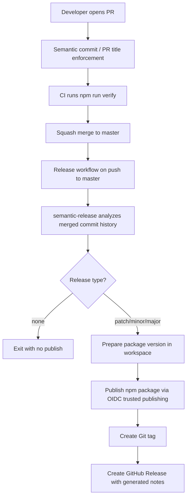

# refactor: Add semantic release pipeline

## Overview

Replace the current Changesets-based release PR flow with a semantic-commit-driven GitHub Actions release pipeline. The new pipeline should infer semver from merged commit history, create Git tags and GitHub Releases automatically, publish `@havesomecode/kibana-mcp-server` to npm through trusted publishing, and stop treating committed version bumps or changelog files as the canonical release record.

## Problem Frame

The repo already has a basic release workflow and package verification, but its current release posture is split across two incompatible models:

- Changesets is configured as the versioning source of truth
- the desired future state is semantic commits driving fully automated releases
- the user explicitly does not want release commits back into the repository, which conflicts with the current release-PR model

That mismatch matters because versioning, changelog generation, publish automation, and merge discipline all need the same source of truth. If semantic-release is added on top of Changesets rather than replacing it, maintainers will be forced to reconcile two separate semver systems and the resulting release record will drift.

## Requirements Trace

- R1. GitHub Actions must bump versions automatically from semantic commit history rather than manual version editing.
- R2. Releases must create Git tags, npm publishes, and GitHub Releases automatically.
- R3. The release pipeline must enforce a semantic commit contract strongly enough that automatic semver is trustworthy.
- R4. The release record must live in tags, npm, and GitHub Releases, not in committed version/changelog bumps.
- R5. The pipeline must align with the current package identity `@havesomecode/kibana-mcp-server` and npm trusted publishing posture.
- R6. Repo docs and maintainer runbooks must describe the new release contract and remove Changesets as the documented source of truth.

## Scope Boundaries

- No product/runtime feature changes to the MCP itself.
- No attempt to automate GitHub repository settings directly if they are not configurable from the repo; those can be documented as operational prerequisites.
- No prerelease channel design (`beta`, `next`, `alpha`) in the first pass unless the release contract requires it later.
- No committed changelog or version bump workflow; that is intentionally excluded.

## Context & Research

### Relevant Code and Patterns

- `.github/workflows/ci.yml` already defines the repo’s main verification path: checkout, Node setup from `.node-version`, `npm ci`, and `npm run verify`.
- `.github/workflows/release.yml` already has the right GitHub Actions permission posture for trusted npm publishing, but it still delegates versioning and publish orchestration to `changesets/action@v1`.
- `.changeset/config.json` and `.changeset/README.md` establish that Changesets is currently the documented versioning source of truth.
- `package.json` already has `publishConfig.access`, `publishConfig.provenance`, and a verified artifact boundary through `npm run verify`.
- `docs/project/release-checklist.md`, `docs/project/npm-publishing.md`, and `docs/project/distribution-strategy.md` currently document a Changesets release PR model and will need to move in lockstep with the automation change.
- `test/package_contract.test.ts` shows this repo prefers explicit contract tests around release-critical metadata rather than trusting YAML and package settings by inspection alone.

### Institutional Learnings

- `docs/plans/2026-04-06-001-refactor-kibana-mcp-professionalization-plan.md` already identified versioning/release automation as a repository contract and explicitly treated validated artifacts as more important than premature public publishing.
- `docs/plans/2026-04-09-001-feat-ergonomic-install-setup-plan.md` tightened the public install contract and raised the importance of keeping release posture, docs, and actual shipped artifacts synchronized.

### External References

- semantic-release’s plugin model documents the default release shape around commit analysis, release notes generation, npm publishing, and GitHub release publication. Source: [semantic-release plugin docs](https://semantic-release.gitbook.io/semantic-release/usage/plugins)
- semantic-release’s release workflow docs show `master`/`main` as normal release branches and use commit history as the release input. Source: [semantic-release release workflow recipe](https://semantic-release.gitbook.io/semantic-release/recipes/release-workflow/pre-releases)
- Conventional Commits defines the commit semantics semantic-release uses to infer `major`, `minor`, and `patch` releases. Source: [Conventional Commits 1.0.0](https://www.conventionalcommits.org/en/v1.0.0/)
- commitlint’s setup docs describe the standard config and CI enforcement posture for Conventional Commits. Source: [commitlint getting started](https://commitlint.js.org/guides/getting-started.html)
- npm’s trusted publishing docs remain the authoritative source for GitHub Actions OIDC publication. Source: [npm trusted publishers](https://docs.npmjs.com/trusted-publishers)

## Key Technical Decisions

- **Replace Changesets instead of running both systems in parallel:** semantic-release should become the only semver and release-notes engine. Running Changesets and semantic-release together would create two sources of truth for versioning and release intent.
- **Do not commit release artifacts back into the repository:** semantic-release should publish from its prepared workspace and create tags/releases, but it should not use changelog or git plugins that mutate `package.json` or `CHANGELOG.md` in git history. This matches the stated release-record requirement.
- **Treat semantic merge inputs as a repo contract, not a maintainer convention:** the plan should enforce Conventional Commits in CI and at PR merge boundaries, not just document them. Without enforcement, auto-semver is a guess, not a contract.
- **Prefer squash-merge-compatible release semantics:** semantic-release analyzes default-branch commits. Because this repo releases from `master` and squash merges collapse branch history into one final commit, semantic PR titles should be treated as the primary release signal that survives onto `master`; commit-message linting is a secondary guardrail, not the source of truth.
- **Keep GitHub Actions and repo-local verification aligned:** CI and release should continue reusing `npm run verify` and explicit contract checks rather than encoding fragile logic directly in workflow YAML.
- **Move release-note authority to GitHub Releases rather than committed changelog files:** if the repo will not commit release notes back, the canonical human-readable changelog should be the generated GitHub Release body, not a drifting `CHANGELOG.md`.

## Open Questions

### Resolved During Planning

- **Should release automation write committed version bumps or changelog updates back into the repo?** No. Tags, npm, and GitHub Releases are the release record.
- **Should the repo keep Changesets as a parallel mechanism?** No. semantic-release should replace it outright.
- **What should be treated as the release-safe semantic input?** Semantic PR titles are the authoritative release input, with squash merge expected on the default branch and commit-message linting used only as a supporting guardrail.

### Deferred to Implementation

- **Exact semantic-release plugin package set and config file shape:** this is an implementation detail once the pipeline contract is accepted.
- **Whether to keep `CHANGELOG.md` as a static informational file or remove it from shipped package files:** the plan should resolve the contract, but the exact artifact treatment can be finalized while editing `package.json`.
- **Exact GitHub repository settings for squash merge, merge commits, and branch protection:** these may need manual maintainer actions outside the repo even if the docs and workflows are updated here.

## High-Level Technical Design

> *This illustrates the intended approach and is directional guidance for review, not implementation specification. The implementing agent should treat it as context, not code to reproduce.*

The critical contract is that the merged commit history on `master` is semantically meaningful. Everything else in the pipeline depends on that being true.

## Alternative Approaches Considered

- **Keep Changesets and only add semantic commit linting:** rejected because the versioning source of truth would still be Changesets, not commit history.
- **Use release-please instead of semantic-release:** rejected because release-please still centers committed release PRs and repo-mutating version bumps, which conflicts with the desired release record.
- **Use semantic-release with changelog/git plugins:** rejected because it would reintroduce committed release artifacts and blur the “tags/npm/GitHub Releases only” boundary.

## Dependencies / Prerequisites

- The npm package identity must remain `@havesomecode/kibana-mcp-server`.
- npm trusted publishing must be configured for the actual GitHub repository and workflow after the pipeline is updated.
- Branch protection and merge policy must support the semantic-input contract; the repo cannot rely on direct pushes to `master` if release automation is driven from commit history.
- Existing `.changeset/*.md` files need a one-time migration decision because they no longer fit the post-Changesets model.

## Phased Delivery

### Phase 1

- Establish the semantic-release contract in repo config and tests.
- Remove Changesets as the documented and automated release path.

### Phase 2

- Enforce semantic inputs in CI/PR workflows and document required repo settings.
- Replace the release workflow and trusted publishing documentation.

## Implementation Units

- [ ] **Unit 1: Replace Changesets with a semantic-release contract**

**Goal:** Make semantic-release the only release/versioning authority in the repository.

**Requirements:** R1, R2, R4, R5

**Dependencies:** None

**Files:**
- Create: `.releaserc.json`
- Create: `test/release_contract.test.ts`
- Modify: `package.json`
- Modify: `package-lock.json`
- Modify or Delete: `CHANGELOG.md`
- Modify: `test/package_contract.test.ts`
- Delete: `.changeset/config.json`
- Delete: `.changeset/README.md`
- Delete: `.changeset/eight-radios-admire.md`
- Delete: `.changeset/forty-deers-unite.md`

**Approach:**
- Remove Changesets scripts and dependencies from `package.json`.
- Add semantic-release plus the npm/GitHub/commit-analysis plugins needed for fully automated semver and release-note generation.
- Configure semantic-release so it publishes and creates releases without committing version or changelog updates back to git.
- Add a release contract test that proves the repo no longer depends on Changesets and that the semantic-release config matches the intended package/release contract.
- Resolve the shipped artifact stance for `CHANGELOG.md` explicitly rather than leaving a stale file in the package by accident; either remove it from published files or convert it into a clearly non-canonical static note.

**Execution note:** Start with a failing release contract test so the migration is encoded as a repo contract, not just a YAML edit.

**Patterns to follow:**
- Reuse the explicit package-contract verification style in `test/package_contract.test.ts`.
- Keep release-critical logic verifiable via repo-local scripts/tests instead of hidden inside GitHub Actions.

**Test scenarios:**
- Happy path: the repo contains a semantic-release config that targets `master` and the npm/GitHub publish plugins.
- Happy path: `package.json` no longer references Changesets scripts or dependencies.
- Edge case: the package contract still points at the correct binary entrypoints and public package name after the release-tool migration.
- Error path: a stale Changesets config or stale release script causes the release contract test to fail before CI can publish.
- Integration: `npm run verify` still passes with the new release-tool contract in place.

**Verification:**
- The repo has one release engine, not two, and release-critical metadata is protected by contract tests.

- [ ] **Unit 2: Enforce semantic release inputs at PR and commit boundaries**

**Goal:** Make commit semantics reliable enough for automatic semver inference.

**Requirements:** R1, R3, R4

**Dependencies:** Unit 1

**Files:**
- Create: `commitlint.config.cjs`
- Create: `.github/workflows/semantic-commits.yml`
- Modify: `.github/pull_request_template.md`
- Modify: `docs/project/release-checklist.md`
- Test: `test/release_contract.test.ts`

**Approach:**
- Add commitlint configuration for Conventional Commits.
- Enforce semantic PR titles in GitHub Actions as the required merge gate, because the squash-merged PR title is the release input semantic-release will actually analyze on `master`.
- If commit-message linting is added, keep it secondary and compatible with normal branch cleanup so local WIP history does not become the primary release contract.
- Document the expected merge strategy in repo guidance: squash merge should be the default so the final `master` commit carries the reviewed semantic title.
- Keep the enforcement model compatible with automation and maintainers: the goal is deterministic release inputs, not maximal friction for every local WIP commit.

**Patterns to follow:**
- Mirror the repo’s existing single-purpose workflow style in `.github/workflows/ci.yml` and `.github/workflows/release.yml`.
- Keep maintainer-facing policy changes in `docs/project/release-checklist.md` and adjacent project docs rather than scattering them across issue comments or tribal knowledge.

**Test scenarios:**
- Happy path: a PR title like `feat: add X` or `fix: correct Y` passes semantic validation.
- Edge case: a `feat!:` or `BREAKING CHANGE:` signal is accepted and preserved as a major-release indicator.
- Error path: a non-conventional PR title or invalid commit message fails the semantic enforcement workflow.
- Integration: the release contract test asserts the semantic enforcement workflow and commitlint config exist and point at the Conventional Commits policy.

**Verification:**
- A change cannot merge cleanly into the release branch without passing semantic input validation.

- [ ] **Unit 3: Replace the GitHub Actions release workflow with semantic-release publishing**

**Goal:** Publish npm packages, tags, and GitHub Releases automatically from verified default-branch commits.

**Requirements:** R1, R2, R4, R5

**Dependencies:** Units 1-2

**Files:**
- Modify: `.github/workflows/release.yml`
- Modify: `.github/workflows/ci.yml`
- Modify: `package.json`
- Create: `scripts/verify-release-contract.mjs`
- Test: `test/release_contract.test.ts`

**Approach:**
- Replace `changesets/action@v1` with a release step that runs semantic-release after `npm run verify`.
- Preserve the current trusted-publishing permission posture (`id-token: write`) and keep npm publish running from GitHub Actions rather than local maintainer machines.
- Add a release-contract verification script for workflow/package alignment so the pipeline shape remains testable as the repo evolves.
- Ensure the workflow exits cleanly when there is no releasable commit type, rather than treating “no release” as a failure.
- Keep release creation on `push` to `master`, with `workflow_dispatch` retained only if maintainers still need manual reruns.

**Patterns to follow:**
- Reuse the repo’s existing `npm run verify` gate instead of duplicating test/build logic in workflow YAML.
- Preserve the current minimal-permissions posture already encoded in `.github/workflows/release.yml`.

**Test scenarios:**
- Happy path: a `feat:` commit on `master` produces a minor release path with npm publish, git tag, and GitHub Release creation.
- Happy path: a `fix:` commit produces a patch release path.
- Edge case: a commit batch with no releasable type exits without publishing and without failing the workflow.
- Edge case: a `BREAKING CHANGE` signal produces a major release path.
- Error path: misaligned workflow/config/package settings fail `scripts/verify-release-contract.mjs` or `test/release_contract.test.ts` before a publish attempt.
- Integration: the release workflow, release config, and package metadata stay aligned around `@havesomecode/kibana-mcp-server` and OIDC publishing.

**Verification:**
- A verified push to `master` is sufficient to create a release end to end, with no release PR and no manual version editing.

- [ ] **Unit 4: Update release docs and maintainer operations for the new source of truth**

**Goal:** Make the new release contract understandable and operable for maintainers.

**Requirements:** R4, R5, R6

**Dependencies:** Units 1-3

**Files:**
- Modify: `README.md`
- Modify: `docs/project/distribution-strategy.md`
- Modify: `docs/project/npm-publishing.md`
- Modify: `docs/project/release-checklist.md`
- Modify: `docs/project/support-policy.md`

**Approach:**
- Remove or rewrite references to Changesets release PRs, committed version bumps, and repo-committed changelog generation.
- Document the new release record explicitly: semantic commit history -> semantic-release -> tag/npm/GitHub Release.
- Document the operational prerequisites that live outside the repo, including trusted publisher setup, branch protection, and squash merge policy.
- Keep public install docs aligned with the actual package name and actual release workflow.

**Patterns to follow:**
- Reuse the project posture style already established in `docs/project/distribution-strategy.md`, `docs/project/release-checklist.md`, and `docs/project/support-policy.md`.

**Test scenarios:**
- Test expectation: none -- this unit updates release posture, governance, and docs rather than runtime behavior.

**Verification:**
- A maintainer reading repo docs can understand how releases happen, what semantic inputs are required, and what operational settings must exist outside the repo.

## System-Wide Impact

- **Interaction graph:** PR titles/commit messages, CI validation, release workflow, package metadata, npm trusted publishing, and GitHub Releases become one shared contract rather than separate maintainer habits.
- **Error propagation:** invalid semantic inputs should fail before merge; workflow/config drift should fail during `npm run verify`; publish/auth problems should fail in the release workflow rather than silently producing partial release state.
- **State lifecycle risks:** the package version in git will no longer be a durable release record, so docs and maintainer expectations must stop treating it that way.
- **API surface parity:** release docs, package metadata, npm publishing docs, and GitHub workflow behavior all need to agree on the package name `@havesomecode/kibana-mcp-server`.
- **Integration coverage:** cross-file verification needs to prove workflow/config/package consistency because unit tests alone will not catch drift across YAML, package metadata, and release docs.
- **Unchanged invariants:** the runtime artifact boundary, Node 22+ support posture, and trusted-publishing preference remain intact even though the versioning engine changes.

## Risks & Dependencies

| Risk | Mitigation |
|------|------------|
| semantic-release and Changesets overlap during migration and create conflicting release expectations | Remove Changesets config/scripts/docs in the same tranche that introduces semantic-release |
| semantic version inference is wrong because merge inputs are inconsistent | Enforce Conventional Commits in CI and document squash merge / branch protection as required operational policy |
| npm publish still fails because trusted publishing or 2FA posture is wrong | Keep npm trusted publishing setup explicit in docs and verify release workflow permissions before enabling the pipeline |
| Maintainers still look for committed version bumps or `CHANGELOG.md` updates | Rewrite release docs and checklist to make tags/npm/GitHub Releases the only release record |
| Existing unreleased `.changeset/*.md` files create migration ambiguity | Handle them as a one-time cleanup/migration unit rather than leaving them in the repo post-cutover |

## Documentation / Operational Notes

- Branch protection should require CI and semantic-input checks before merge to `master`.
- Squash merge should be the default merge strategy if semantic PR titles are treated as the final release input.
- Trusted publishing on npm must be reconfigured or verified for the actual maintainer account and the package `@havesomecode/kibana-mcp-server`.
- If GitHub Releases become the canonical changelog, package/readme/docs should stop implying that `CHANGELOG.md` is authoritative.

## Sources & References

- Related workflow: `.github/workflows/release.yml`
- Related workflow: `.github/workflows/ci.yml`
- Related config: `.changeset/config.json`
- Related docs: `docs/project/npm-publishing.md`
- Related docs: `docs/project/release-checklist.md`
- Related docs: `docs/project/distribution-strategy.md`
- External docs: https://semantic-release.gitbook.io/semantic-release/usage/plugins
- External docs: https://semantic-release.gitbook.io/semantic-release/recipes/release-workflow/pre-releases
- External docs: https://www.conventionalcommits.org/en/v1.0.0/
- External docs: https://commitlint.js.org/guides/getting-started.html
- External docs: https://docs.npmjs.com/trusted-publishers
